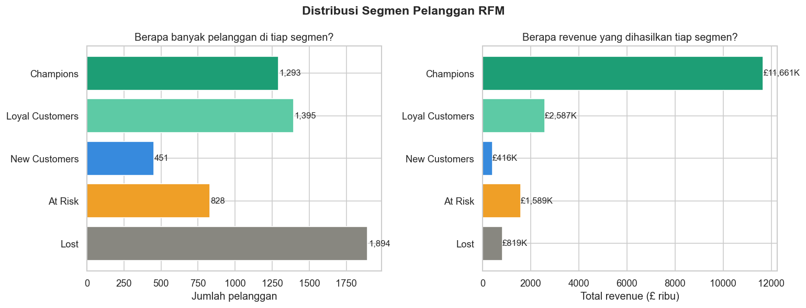
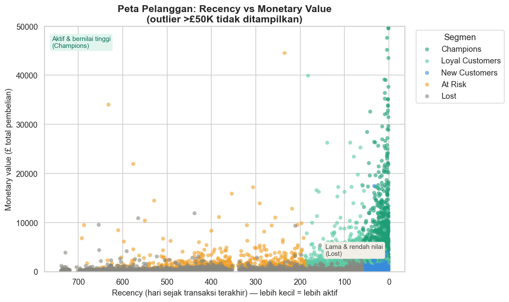
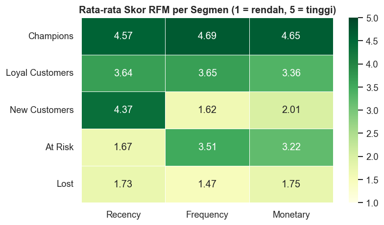
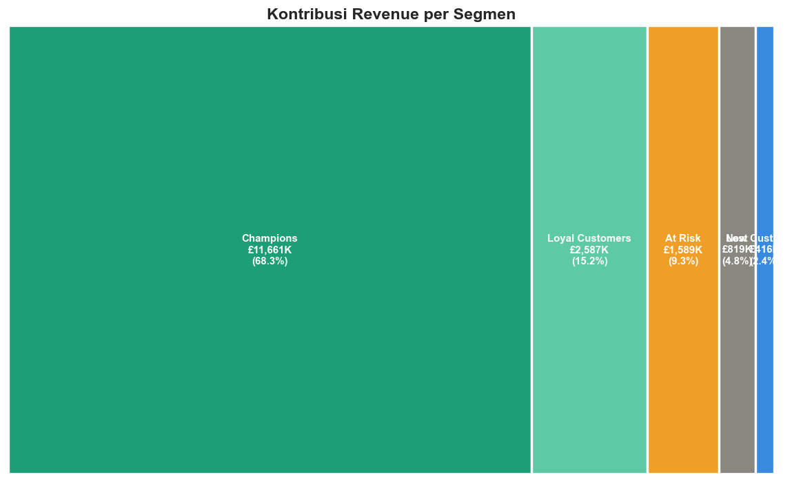
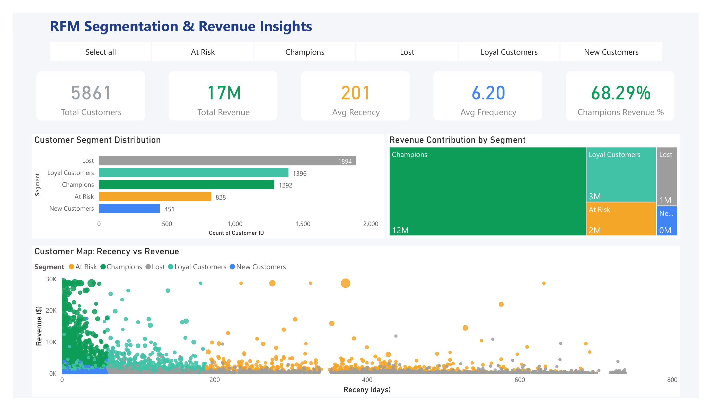

# RFM Customer Segmentation Analysis
### E-Commerce | Python · Pandas · Matplotlib · Power BI

Analisis segmentasi pelanggan menggunakan metode **RFM (Recency, Frequency, Monetary)** pada dataset transaksi e-commerce UCI Online Retail II — 1 juta+ transaksi, 5.861 pelanggan unik, rentang Desember 2009 hingga Desember 2011.

---

## Business Problem

Tim marketing kesulitan mengalokasikan budget promosi secara efektif karena semua pelanggan diperlakukan sama, padahal perilaku dan nilai mereka sangat berbeda.

**Pertanyaan bisnis yang dijawab:**
- Siapa pelanggan paling berharga yang perlu dipertahankan?
- Siapa yang mulai pergi dan perlu di-*win back*?
- Di mana budget promosi paling efektif digunakan?

---

## Dataset

**UCI Online Retail II** — transaksi e-commerce dari retailer gift items berbasis UK.
- Sumber: [UCI Machine Learning Repository](https://archive.ics.uci.edu/ml/datasets/Online+Retail+II)
- 1.067.371 baris mentah · 8 kolom · Desember 2009 – Desember 2011
- Setelah cleaning: 715.649 baris valid · 5.861 pelanggan unik

---

## Metodologi

```
Raw Data → Data Cleaning → Hitung RFM → Scoring (1–5) → Segmentasi → Visualisasi & Insight
```

**Tahap cleaning yang dilakukan:**
- Hapus 243.007 baris tanpa Customer ID
- Hapus 19.494 transaksi cancelled (Invoice prefix 'C')
- Hapus 22.950 baris Quantity negatif (retur)
- Hapus 6.207 baris Price negatif & nol
- Hapus StockCode non-produk: `POST`, `DOT`, `BANK CHARGES`, `TEST`, `gift_voucher`
- Hapus 34.335 baris duplikat

**Penanganan outlier:**
Monetary di-cap di persentil ke-99 (£28.616) untuk scoring, mencegah 59 pelanggan B2B mendominasi seluruh segmen. Nilai Monetary asli tetap dipertahankan untuk display.

---

## Hasil Segmentasi

| Segmen | Jumlah Pelanggan | % Pelanggan | Total Revenue | % Revenue |
|--------|-----------------|-------------|---------------|-----------|
| **Champions** | 1.293 | 22.1% | £11.661K | **68.3%** |
| Loyal Customers | 1.395 | 23.8% | £2.587K | 15.2% |
| At Risk | 828 | 14.1% | £1.589K | 9.3% |
| Lost | 1.894 | 32.3% | £819K | 4.8% |
| New Customers | 451 | 7.7% | £416K | 2.4% |
| **Total** | **5.861** | **100%** | **£17.073K** | **100%** |

---

## Visualisasi

### Distribusi Segmen Pelanggan


### Peta Pelanggan: Recency vs Monetary Value


### Rata-rata Skor RFM per Segmen


### Kontribusi Revenue per Segmen


### Power BI Dashboard


---

## Key Insights

**1. Pareto Ekstrem — 22% pelanggan menghasilkan 68% revenue**
Champions hanya 1.293 orang dari 5.861 total pelanggan, namun menghasilkan £11.661K dari total £17.073K revenue. Ini jauh melampaui aturan Pareto 80/20 yang umum. Bisnis ini sangat bergantung pada segelintir pelanggan — kehilangan sebagian Champions dapat mengurangi revenue hingga £1.1M.

**2. At Risk: Peluang Recovery £1.589K yang Sering Diabaikan**
828 pelanggan At Risk rata-rata sudah tidak bertransaksi selama 369 hari, padahal rata-rata spending mereka £1.920 per pelanggan — hampir setara dengan Loyal Customers (£1.854). Win-back campaign dengan voucher 15–20% berpotensi me-recovery sebagian dari £1.589K revenue segmen ini sebelum mereka benar-benar Lost.

**3. New Customers Berisiko Churn Sebelum Jadi Loyal**
451 New Customers hanya menyumbang 2.4% revenue (£416K) dengan rata-rata 1.5 transaksi dan recency 28 hari — masih aktif tapi belum terikat. Tanpa onboarding terstruktur, mayoritas kemungkinan besar akan masuk ke segmen Lost di periode berikutnya.

**4. Lost Menguras Perhatian Tanpa Hasil Signifikan**
Lost adalah segmen terbesar (1.894 pelanggan, 32.3%) namun hanya menghasilkan 4.8% revenue (£819K). Mengalihkan budget marketing dari segmen ini ke Champions retention dan At Risk win-back adalah keputusan paling efisien secara ROI.

**5. Heatmap Mengkonfirmasi Validitas Segmentasi**
Distribusi skor RFM sangat bersih: Champions mendominasi semua dimensi (R:4.57, F:4.69, M:4.65). At Risk tinggi di F dan M tapi sangat rendah di R (1.67) — mengkonfirmasi bahwa mereka adalah pelanggan yang dulu aktif dan bernilai tinggi, bukan pelanggan baru yang underperform.

---

## Rekomendasi Strategi Marketing

| Prioritas | Segmen | Aksi | Estimasi Impact |
|-----------|--------|------|-----------------|
| 1 | Champions | Program loyalti eksklusif, early access produk baru, referral reward | Pertahankan 68% revenue |
| 2 | At Risk | Win-back campaign, voucher kembali, survey alasan berhenti beli | Recovery £1.589K |
| 3 | New Customers | Email onboarding series, diskon pembelian kedua | Konversi ke Loyal |
| 4 | Loyal Customers | Upsell & cross-sell, membership tier, diskon ulang tahun | Tingkatkan £2.587K |
| 5 | Lost | Stop spend iklan, alihkan budget ke segmen prioritas | Efisiensi budget |

---

## Tools & Stack

| Kategori | Tools |
|----------|-------|
| Data Processing | Python, Pandas, NumPy |
| Visualisasi | Matplotlib, Seaborn |
| Dashboard | Power BI Desktop |
| Environment | Jupyter Notebook, virtualenv |

---

## Struktur Folder

```
rfm-customer-segmentation/
│
├── charts/
│   ├── chart_01_distribusi.png
│   ├── chart_02_scatter.png
│   ├── chart_03_heatmap.png
│   ├── chart_04_treemap.png
│   └── dashboard_preview.png
│
├── notebooks/
│   ├── rfm_01_load_and_clean.ipynb
│   ├── rfm_02_score_and_segment.ipynb
│   └── rfm_03_visualization.ipynb
│
├── data/
│   ├── data_clean.csv
│   └── rfm_result.csv
│
├── dashboard.pbix
├── .gitignore
├── requirements.txt
└── README.md
```

## Cara Menjalankan

```bash
# 1. Clone repo
git clone https://github.com/username/rfm-customer-segmentation.git
cd rfm-customer-segmentation

# 2. Buat virtual environment
python -m venv venv
venv\Scripts\activate     # Windows
source venv/bin/activate  # Mac/Linux

# 3. Install dependencies
pip install -r requirements.txt

# 4. Download dataset
# https://archive.ics.uci.edu/ml/datasets/Online+Retail+II
# Simpan ke folder notebooks/ dengan nama 'Online Retail.csv'

# 5. Jalankan notebook secara berurutan di Jupyter
jupyter notebook
```

---

*Proyek ini dibuat sebagai bagian dari portofolio data analis.*
